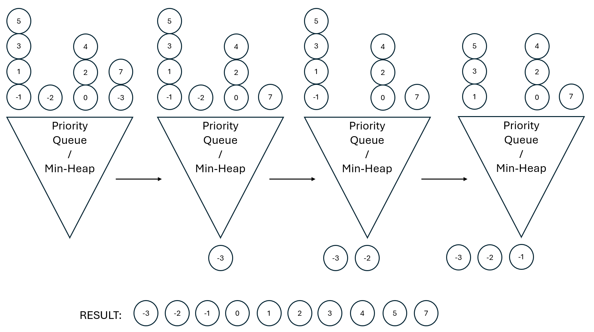

# Merge K sorted Lists
Implementation and testing of the Merge K Sorted Lists algorithm

### Data Structures
1. Priority queue or min-heap. A container that allows for O(1) retrieval of the smallest item it contains, at the cost of log(n) time for adding or removing items. We need this because the collection of lists is unsorted.
2. Linked list, queue, or array. A container that allows for O(1) retrieval of the smallest item it contains, assuming they are already sorted. In this implementaion, we use a double-ended queue because they are easy to create and they are intuitive to use. 

### Algorithm
Place the first item from each list in to the min-heap. Continually pop items from the top of the min-heap and append them to the output. Each time we pop from the min-heap, we must track the specific list from which that item came, remove the next item from that list, and place it in the min-heap. We repeat this process until all lists and the min-heap are empty. 

### Time and Space Complexity
Let n = the total number of items, and k = the number of lists. 
The min-heap has up to k items in it at a time, taking O(k) additional space. Also, each min-heap action takes O(log k) time.  
For each of the n items, we must:
1. Incrementing the list from which it came in O(1) time
2. Append to the output in O(1) time
3. Insert and remove an item from the min-heap in 2*O(log k) time

The dominating pieces are O(n log k) time and O(k) additional space.